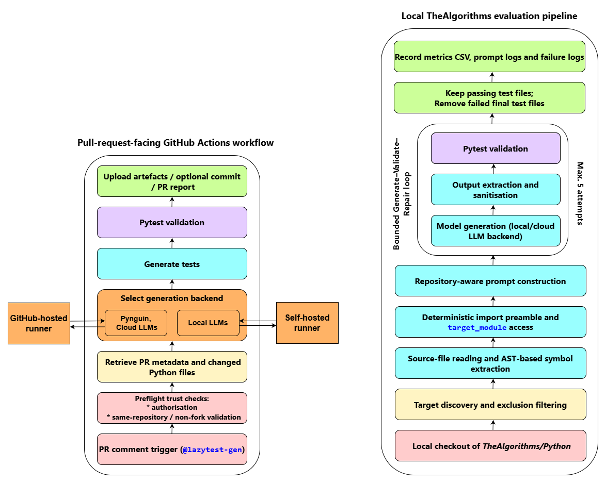

# LazyTest

LazyTest is an individual final-year dissertation project developed at the University of Manchester to investigate repository-aware automated unit-test generation for Python. It combines a pull-request-facing GitHub Actions workflow with a separate local empirical pipeline built around Python AST analysis, deterministic `importlib` loading, pytest execution, LLM-backed generation and repair, pytest-cov coverage measurement, Pynguin, and Cosmic Ray mutation testing. The project was evaluated through a controlled case study on TheAlgorithms/Python; its results are not presented as evidence that the approach generalises to arbitrary Python repositories.

## Architecture



The repository also retains the transparent source diagram at
`docs/lazytest_architecture.png`. The opaque rendering above remains readable on
both light and dark GitHub page backgrounds.

LazyTest contains two related but distinct artefacts:

1. **Pull-request-facing GitHub Actions workflow.** An academic prototype, tested end-to-end on a real pull request, which accepts a PR comment command, checks the request, discovers changed Python files, selects a generation backend, validates generated tests, uploads artefacts and posts a PR report.
2. **Separate local empirical evaluation pipeline.** The research pipeline used for the dissertation experiments on TheAlgorithms/Python. It adds AST-derived context, deterministic import handling, output sanitisation, a bounded Generate–Validate–Repair loop, detailed logging, coverage recomputation and offline mutation analysis.

The **five-attempt Generate–Validate–Repair loop belongs to the local empirical pipeline, not to the GitHub Actions workflow**. The workflow generates or refines tests and then performs PR-oriented pytest validation; it does not reproduce the local experimental repair loop.

## What the project does

The GitHub Actions layer exposes test generation through the `@lazytest-gen` pull-request command. It retrieves PR metadata, filters changed non-test Python files and dispatches to Pynguin, cloud LLM, local LLM or Pynguin-plus-LLM refinement routes. Generated tests are validated with pytest, retained as workflow artefacts, summarised in CSV and JSON metadata, and reported back to the pull request. Depending on the selected commit mode, generated files can also be committed to the PR branch.

The local evaluation layer processes a controlled repository checkout file by file. It extracts public top-level functions and classes with Python's `ast` module, supplies this bounded target context to the model, removes model-written imports, and prepends a deterministic loading preamble. The target file is loaded through `importlib.util.spec_from_file_location` and exposed through a stable `target_module` interface. Each generated suite is executed immediately; failures and tracebacks can be returned to the model for another attempt, up to five total attempts. Accepted tests are then evaluated through separate statement and branch coverage recomputation and Cosmic Ray mutation testing.

## Key engineering features

- **AST-based symbol extraction** constrains generation to public functions and classes actually defined in the target file.
- **Deterministic module loading** uses `importlib`, controlled `sys.modules` registration and the `target_module` access pattern instead of relying on model-generated target imports.
- **Execution of every generated suite** uses pytest before a local test file is accepted.
- **Bounded repair** permits up to five total generation attempts per target in the local empirical pipeline.
- **Timeouts and failure logging** prevent individual targets or external tools from blocking the complete run and preserve diagnostic evidence.
- **Output sanitisation** extracts usable pytest code from fenced, truncated or explanatory model responses.
- **Branch-aware coverage recomputation** reruns accepted tests individually, matches source files by repository-relative path and gives no coverage credit when the strict rerun fails.
- **Cosmic Ray mutation testing** validates an unmutated baseline, runs mutations in isolated repository copies and records killed, survived, incompetent, timed-out and other outcomes separately.
- **Hosted/self-hosted routing** uses GitHub-hosted execution for Pynguin and API-backed routes, and a self-hosted runner for local-LLM modes requiring specialised hardware.
- **PR trust checks** restrict the command to `OWNER`, `MEMBER` or `COLLABORATOR` users and refuse forked pull requests before checkout and execution.

## Verified results

The main matched comparison used the same five-attempt validation and repair allowance for the generic baseline and repository-aware conditions. The intended contrast was therefore the repository-aware pipeline mechanisms, rather than repaired generation versus an unrepaired baseline.

| Route       | Generic baseline | Repository-aware LazyTest | Difference |
| ----------- | ---------------: | ------------------------: | ---------: |
| Qwen 27B    |           91.70% |                    95.10% |   +3.40 pp |
| Qwen 9B     |           71.15% |                    77.19% |   +6.04 pp |
| Qwen 9B AWQ |           66.52% |                    75.87% |   +9.35 pp |

All percentages use the fixed **1,144-file generation target set** discovered in TheAlgorithms/Python after technical filtering. Repository-aware LazyTest achieved higher final full-target-set executability in all three matched comparisons.


The figure additionally shows target-normalised combined coverage and viable
mutation score. These metrics use different surviving denominators from generation
pass rate; see the [remaining dissertation figures](docs/results/README.md).

This result should be interpreted carefully. Generic-baseline tests that survived generation and later evaluation sometimes achieved higher coverage or viable mutation scores than the corresponding repository-aware surviving subsets. The evidence therefore supports **broader executability across the complete target set**, not universal superiority in the strength of every accepted test. The comparison was also pipeline-level: it did not separately isolate the causal contribution of AST extraction, deterministic imports, import stripping, output sanitisation, prompt restrictions or `target_module` access.

## Repository structure

The important implementation artefacts are listed below. Several route-specific and historical scripts remain in the research repository; the canonical files should be made explicit before public release.

| Path | Purpose |
| --- | --- |
| `.github/workflows/lazytest-generator.yml` | Pull-request-facing GitHub Actions workflow for trusted, same-repository collaborators. |
| `testing/scripts/generate_tests_qwen_3.5_fixed_mut.py` | Canonical supplied repository-aware local generator, including AST extraction, deterministic imports, sanitisation and five-attempt repair. |
| `testing/scripts/generate_baseline.py` | Generic target-file baseline used for the matched comparison; it keeps the same five-attempt allowance but omits the repository-aware import harness and AST-symbol context. |
| `testing/scripts/recalc_branch_coverage.py` | Branch-aware coverage recomputation with strict no-credit handling for failed reruns. |
| `testing/scripts/mutation_score.py` | Cosmic Ray mutation evaluation with baseline validation, isolated copies, timeout handling, resumable CSV output and viable/raw scores. |
| `testing/scripts/retry_mutation_timeouts.py` | Diagnostic rerun of primary mutation timeout cases using a larger timeout budget. |
| `testing/experiments/` | Preserved route-specific and historical research scripts, with a route map explaining their provenance. |
| `results/main_comparisons.csv` | Six-row public evidence table for the three matched README comparisons. It is not the private per-target dataset. |
| `docs/results/` | Publication figures and their source PDFs, with interpretation limits. |
| `docs/lazytest_architecture.png` | Transparent architecture source; the README uses the opaque GitHub rendering beside it. |

## Usage

### GitHub Actions workflow

The workflow is installed as `.github/workflows/lazytest-generator.yml`. It is
intended only for trusted collaborators working on pull-request branches in the same
repository. An authorised user can post one of the following standalone comment
commands:

```text
@lazytest-gen
@lazytest-gen --generator pynguin
@lazytest-gen --generator chatgpt
@lazytest-gen --generator gemini
@lazytest-gen --generator local-llm
@lazytest-gen --generator pynguin-chatgpt
@lazytest-gen --generator pynguin-gemini
@lazytest-gen --generator pynguin-local-llm
```

The default generator is `pynguin`. Supported commit modes are `passing` (default), `all` and `none`:

```text
@lazytest-gen --generator pynguin-gemini --commit-mode passing
@lazytest-gen --generator local-llm --commit-mode none
```

The command parser permits the following controlled Pynguin passthrough options: `--algorithm`, `--maximum-search-time`, `--maximum-test-execution-timeout`, `--maximum-iterations`, `--seed`, `--assertion-generation`, `--population` and `-v`. Unknown arguments are ignored and reported.

Cloud routes require repository secrets `OPENAI_API_KEY` or `GEMINI_API_KEY` as applicable. The optional `LOCAL_LLM_API_KEY` secret supports authenticated OpenAI-compatible local endpoints. Repository variables can set `OPENAI_MODEL`, `GEMINI_MODEL`, `LOCAL_LLM_BASE_URL` and `LOCAL_LLM_MODEL`; the YAML contains fallback values when these variables are absent.

`local-llm` and `pynguin-local-llm` run on a `self-hosted` runner. The other verified modes use `ubuntu-latest`. The workflow refuses forked pull requests and unauthorised comment authors before executing PR code. Optional commits follow the selected commit mode; not every optional branch is claimed to have been exercised in the recorded demonstration.

### Local empirical pipeline

The research scripts are route-specific rather than a single packaged CLI. A representative repository-aware run is started with:

```bash
python testing/scripts/generate_tests_qwen_3.5_fixed_mut.py
```

The evaluation checkout is intentionally not included in this repository. Obtain a
separate TheAlgorithms/Python checkout and pass its location explicitly to the
canonical script. The endpoint start command is deliberately not prescribed here
because the experiments used different local or rented hardware and serving
environments.

Use a disposable evaluation checkout whenever package normalisation is explicitly
enabled. Generated tests, metrics and logs remain local and are excluded from the
public source tree. The generic comparison is implemented separately in
`testing/scripts/generate_baseline.py`.

### Coverage and mutation evaluation

Configure the generated-results root, target checkout and metrics input through the
coverage script's command-line options, then run:

```bash
python testing/scripts/recalc_branch_coverage.py
```

It expects generation run directories containing a metrics CSV and mirrored generated tests. It writes `metrics_statement_branch_coverage.csv` into each processed run directory.

`mutation_score.py` has a real command-line interface. A representative dry run is:

```bash
python testing/scripts/mutation_score.py \
  --generated-root testing/generated_tests \
  --repo-root testing/repos_for_testing/TheAlgorithms \
  --models qwen_3.5 \
  --run-pattern 'run*' \
  --dry-run
```

Remove `--dry-run` to execute mutation testing after confirming the discovered paths and runs. Per-run output defaults to `mutation_cosmic_ray.csv`; combined output defaults to `mutation_cosmic_ray_all.csv`, with a summary JSON and run configuration written under the generated-results root.

## Requirements and environments

There is no single environment or GPU configuration for every route.

- **Common Python/test dependencies:** Python, `pytest`, `pytest-timeout`, and the target repository's own dependencies.
- **Workflow dependencies:** `pytest-cov`, `coverage`, `requests`, `openai`, `google-generativeai`, and `pynguin` for Pynguin-based modes. GitHub Actions also uses `actions/checkout`, `actions/setup-python`, artefact upload, PR commenting and optional auto-commit actions.
- **Local LLM generation:** the `openai` Python client plus a separately provisioned OpenAI-compatible endpoint, such as a supported vLLM or LM Studio deployment. Model-serving dependencies and hardware requirements depend on the selected model.
- **Coverage evaluation:** `pytest-cov`, `coverage` and `pytest-timeout`.
- **Mutation evaluation:** Cosmic Ray, pytest and `pytest-timeout`; the script also requires a Unix-like environment for process-group signalling used during timeout cleanup.
- **Analysis/plotting:** the supplied plotting utility imports `pandas`, `matplotlib` and `seaborn`.

The existing research environment freeze should not be treated as a minimal portable dependency specification.

## Outputs

Depending on the route and stage, LazyTest produces:

- generated pytest files mirroring the target source structure;
- per-target generation metrics CSVs;
- prompt and raw-response debug logs;
- final failure logs and pytest tracebacks;
- statement, branch and combined coverage CSV fields;
- Cosmic Ray per-run CSVs, combined results, configuration and summary JSON files;
- GitHub Actions manifests, run metadata, coverage JSON, result and failure logs;
- pull-request reports and downloadable workflow artefacts.

## Security

> **Generated code and pull-request code must be treated as untrusted.**

The workflow refuses forked pull requests before checkout and limits execution to commands from repository `OWNER`, `MEMBER` or `COLLABORATOR` users. Self-hosted runners should not execute untrusted external contributions. These checks establish a bounded trust boundary, but the prototype is not a complete sandbox for arbitrary untrusted code, generated tests or third-party dependencies.

## Limitations

- The empirical evaluation is a single-repository controlled case study on TheAlgorithms/Python.
- Repository context is bounded to the target source and lightweight AST-derived information; it does not implement full dependency-aware retrieval.
- No ablation study isolates the individual effect of each repository-aware mechanism.
- Generated tests generally lack an independent semantic oracle and are best interpreted as regression-oriented or characterisation tests.
- A repaired suite passing pytest does not guarantee stronger assertions or intended program correctness.
- Model routes used heterogeneous provider settings and hardware environments, so runtime results are not a hardware-normalised model benchmark.
- The GitHub Actions integration is an end-to-end-tested academic prototype, not an externally operated production service.

## Dissertation and further details

A redacted public copy of the final dissertation is being prepared for
`docs/LazyTest_Dissertation.pdf`. The current private source PDF is intentionally not
included because its cover contains a student identifier. The software licence does
not apply to the dissertation.
