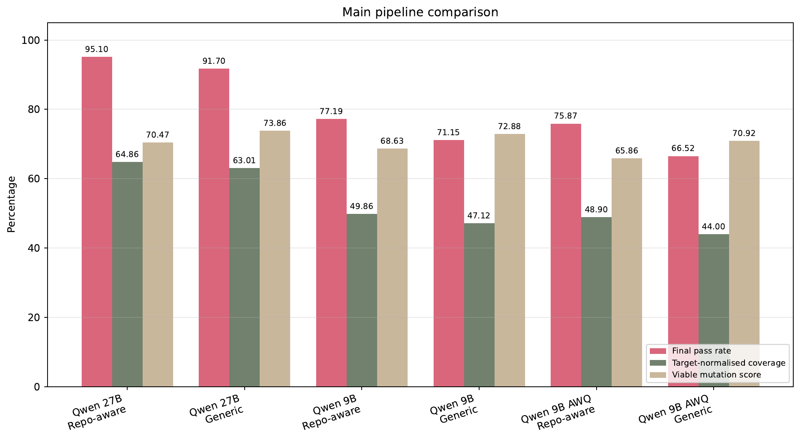
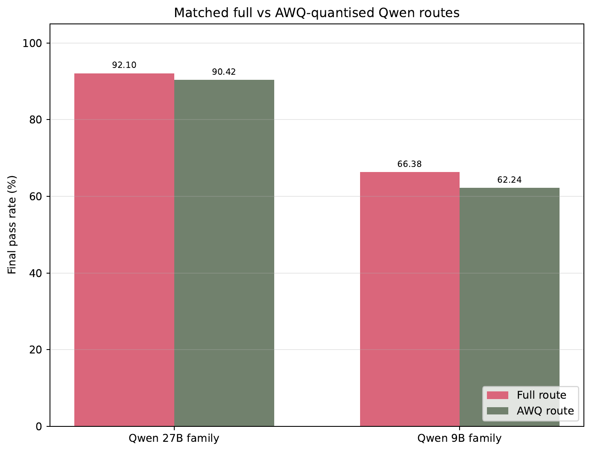
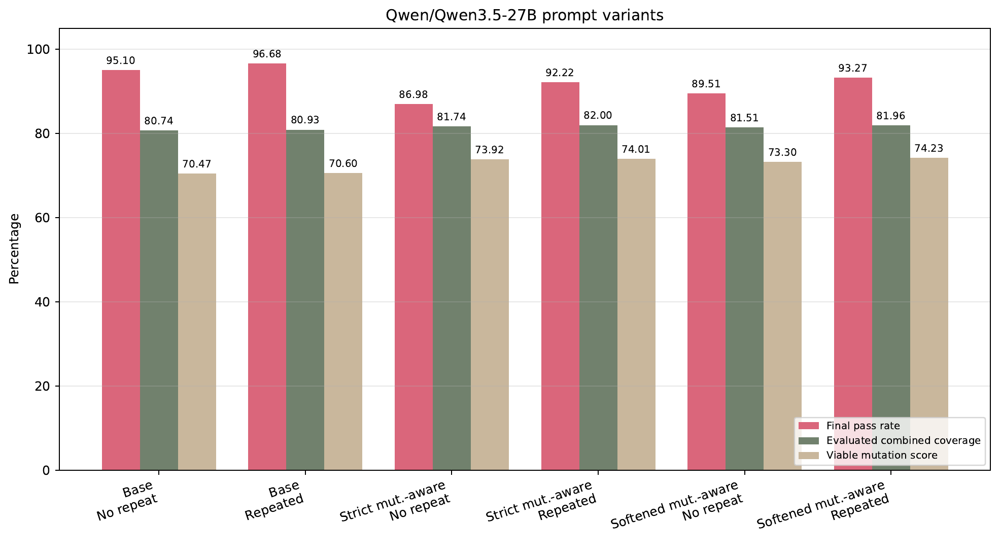
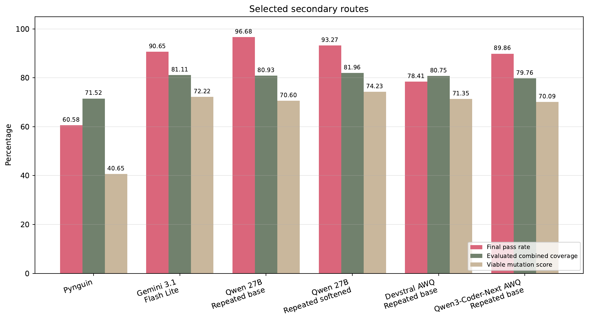

# Dissertation result figures

These figures are publication renderings of the final dissertation figures. Their
source PDFs are preserved in `source-pdfs/`; the PNGs are 180-DPI renderings for
GitHub. The figures report the exact evaluated configurations from a controlled
TheAlgorithms/Python case study, not a universal model leaderboard.

## Main matched pipeline comparison

The three matched pairs compare generic target-file generation with the
repository-aware LazyTest pipeline. Both sides use the same five-total-attempt
validation and repair allowance. Pass-rate, coverage and mutation values have
different surviving denominators; the public six-row CSV focuses only on the
headline final-pass comparison.

## Full and AWQ route summary

These are averages across matched route-level conditions. They do not isolate
quantisation as a causal factor and provide no independently measured VRAM-saving
evidence.

## Qwen 27B prompt variants

This route-specific comparison shows an executability versus viable-mutation-score
trade-off across base, strict mutation-aware and softened mutation-aware prompts.
It is not a component ablation study.

## Selected secondary routes

These routes used different backends and exact evaluated configurations. The figure
must not be interpreted as evidence that LLMs generally outperform Pynguin.

Across all four figures, generation, coverage and mutation metrics can use different
surviving denominators. All claims remain limited to the controlled
TheAlgorithms/Python case study.

